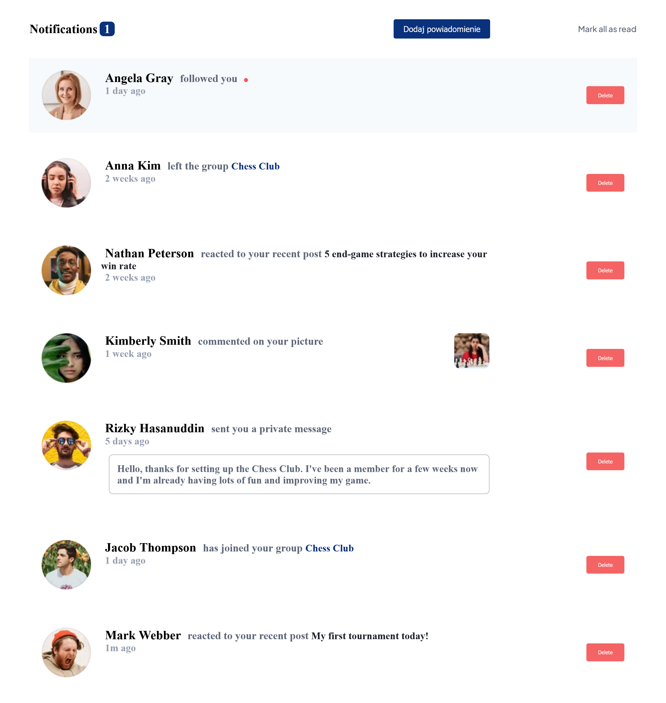
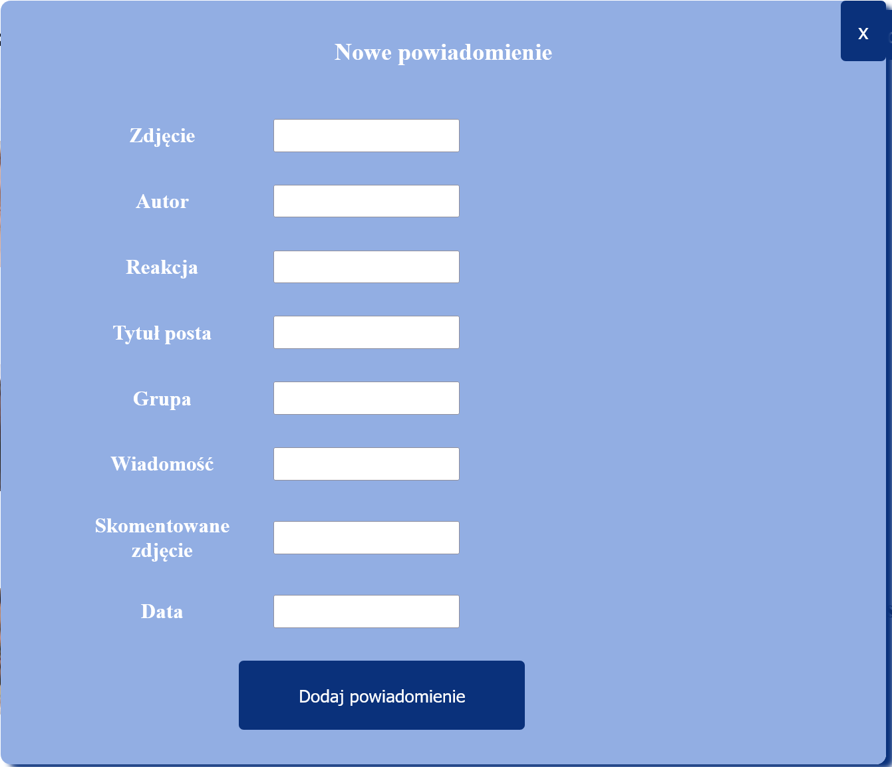

## Notifications with database

It is extended project from [Frontend Mentor](https://www.frontendmentor.io) challenge. I added backend in Laravel and MySQL database for create new notificaations and send it to databse or delete actual notifications.
 - Here is screenshot for desktop view: 

- Here is component with form for adding new notifications:

 
